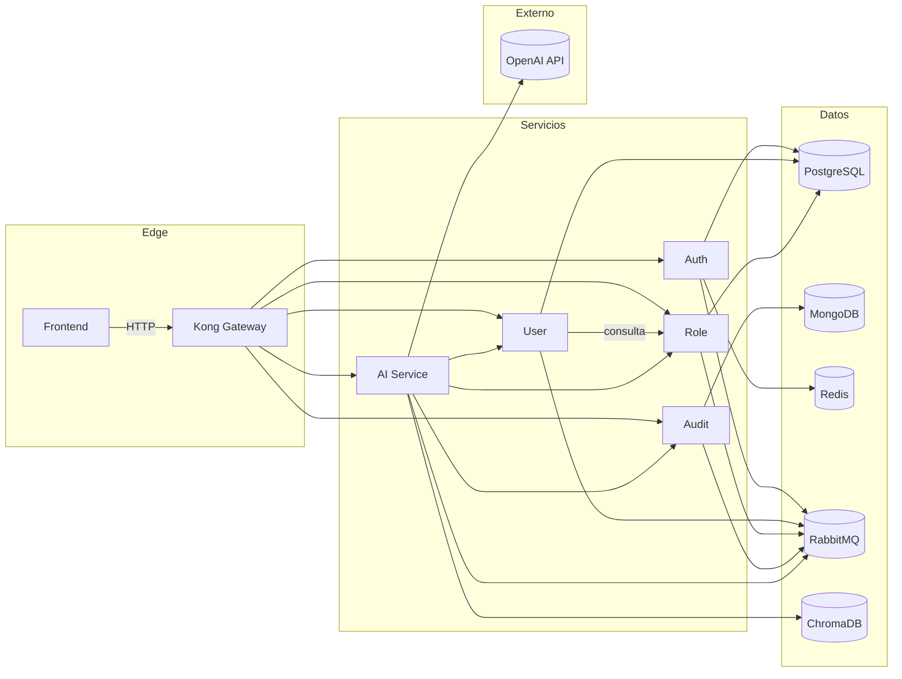

# Arquitectura del sistema

Este diagrama resume los componentes y sus relaciones principales.

Notas de flujo:
- Kong centraliza el acceso y enruta a cada microservicio.
- Auth emite tokens y publica eventos de seguridad/auditoría.
- User y Role publican eventos de dominio hacia RabbitMQ.
- Audit consume eventos y persiste en MongoDB.
- AI consume datos de servicios internos y usa ChromaDB + OpenAI.
